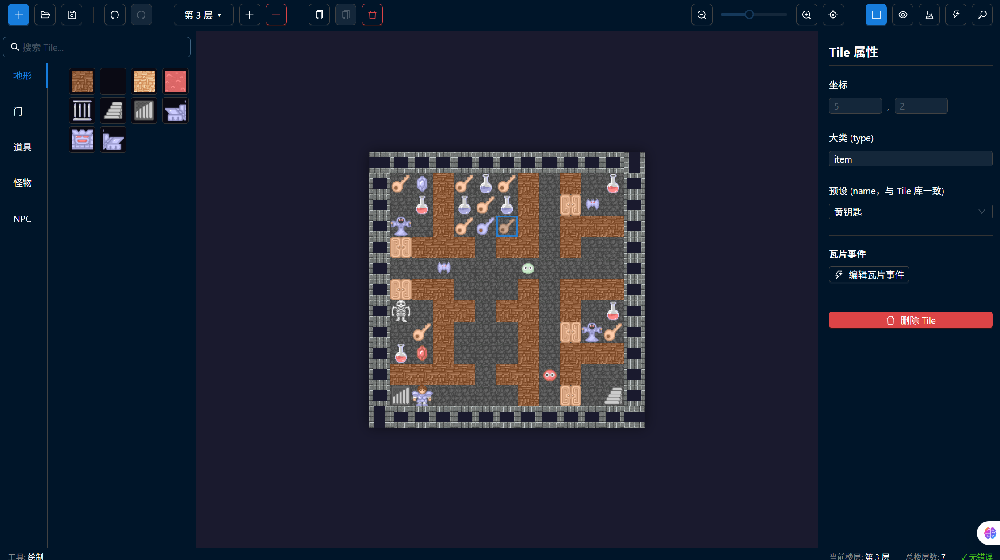
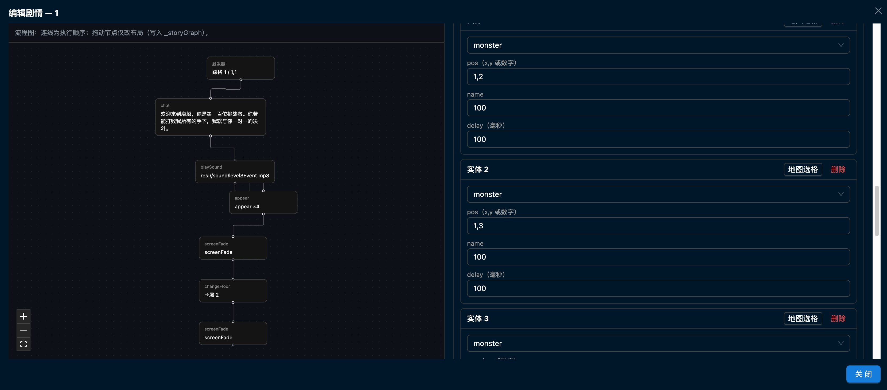

# 魔塔地图与剧情编辑器

基于 Web 的魔塔（Magic Tower）**地图**与 **`story.json` 剧情**编辑工具：可视化摆图、多楼层、剧情节点流程图与表单编辑，导出 JSON 供游戏工程使用。




## 功能概览

### 地图编辑

- 工具栏左上角 **「地图 | 剧情」** 切换工作区。
- 自定义地图宽高；多楼层增删与切换。
- 从 Tile 库选择素材，点击画布放置；**已放置的 Tile 可拖动换位**。
- **任意空格均可点击选中**（含未放置瓦片的格子），便于与剧情编辑器联动填坐标。
- `Delete` 删除当前选中 Tile；右键清空「待放置素材」与选中状态。
- 滚轮缩放、右键拖拽平移画布；显示/隐藏网格。
- **撤销 / 重做**（`Ctrl+Z` / `Ctrl+Y`）。
- 右侧属性面板：选中 Tile 时编辑属性；仅选中空格子时显示坐标说明；未选中时编辑楼层、玩家初始值、楼梯等。

### 剧情编辑（`story.json`）

- 导入 / 导出 JSON；可选加载 `event.json`、`prop.json` 做引用校验。
- 列表筛选（触发类型、楼层、关键字）；校验错误与触发器冲突提示。
- **大窗口编辑**：点击表格行或「编辑」打开 Modal，**左侧 React Flow 流程图**（触发器 → 动作链），**右侧表单**编辑详情；节点可拖动，布局保存在根对象的 **`_storyGraph`**（游戏端可忽略）。
- 与地图联动：在地图模式下选中格子（含空格子）后，回到剧情编辑可使用「使用地图选中格」等能力填入 `tile` 或 `appear` 坐标。详见 [`src/utils/storyMapBridge.ts`](src/utils/storyMapBridge.ts)。

示例数据可参考仓库内 [`docs/story.json`](docs/story.json)。游戏内剧情文件路径一般为 `map_data/story.json`（以你的 Godot 工程为准）。

### Tile 库

- 分类：地形、道具、怪物、NPC、门等；搜索与预设图标。

### 预览模式

- `WASD` / 方向键移动；墙、门、怪物碰撞；拾取与钥匙；状态栏显示 HP、攻防与钥匙。

### 数据与存储

- 地图与剧情均为 **JSON** 导入导出（剧情默认文件名如 `story.json`）。
- 地图 **自动保存** 到浏览器 `localStorage`（约每 5 秒及关闭页面前）。

## 快捷键（地图工作区）

| 快捷键 | 功能 |
| --- | --- |
| `Ctrl + C` | 复制选中的 Tile（须在预设库中存在） |
| `Ctrl + V` | 粘贴为待放置素材，再点击地图放置 |
| `Ctrl + Z` | 撤销 |
| `Ctrl + Y` / `Ctrl + Shift + Z` | 重做 |
| `Delete` | 删除选中的 Tile |
| 鼠标滚轮 | 缩放画布 |
| 右键拖拽 | 平移画布 |
| 右键 | 取消待放置与选中 |

预览模式：`W` `A` `S` `D` 或方向键移动。

## 技术栈

- React 18、TypeScript、Vite  
- Redux Toolkit  
- Ant Design 5  
- [@xyflow/react](https://reactflow.dev/)（剧情流程图）  
- file-saver（导出）

## 开发

```bash
npm install
npm run dev      # 开发服务器
npm run build    # 类型检查 + 生产构建
npm run preview  # 本地预览构建结果
```

## 项目结构（节选）

```
src/
├── components/
│   ├── MapCanvas.tsx          # 地图画布
│   ├── TileLibrary.tsx        # Tile 库
│   ├── PropertyPanel.tsx      # 属性 / 楼层信息
│   ├── Toolbar.tsx            # 工具栏（含地图/剧情切换）
│   ├── PreviewMode.tsx        # 预览
│   └── story/                 # 剧情编辑
│       ├── StoryWorkspace.tsx
│       ├── StoryFlowCanvas.tsx
│       ├── StoryDetailForm.tsx
│       └── nodes/             # React Flow 节点
├── store/
│   ├── mapSlice.ts
│   ├── storySlice.ts
│   └── editorSlice.ts         # workspace: map | story
├── types/
│   ├── map.ts
│   ├── tile.ts
│   └── story.ts
├── utils/
│   ├── mapUtils.ts
│   ├── storyJson.ts           # 解析 / 序列化 story
│   ├── storyValidation.ts
│   └── storyFlowAdapter.ts    # 流程图布局与节点 id
└── data/presetTiles.ts
```

## 地图 JSON 格式（导出）

```json
{
  "version": "1.0",
  "totalFloors": 1,
  "currentFloor": 1,
  "floors": [
    {
      "floorId": 1,
      "mapWidth": 12,
      "mapHeight": 12,
      "playerStart": { "x": 1, "y": 1, "hp": 1000, "attack": 10, "defense": 10, "gold": 0, "yellowKeys": 0, "blueKeys": 0, "redKeys": 0 },
      "tiles": [],
      "stairs": { "up": null, "down": null }
    }
  ]
}
```

## 剧情 JSON 格式（节选）

根对象含 `stories` 数组；可选 `_storyGraph` 保存编辑器节点坐标。完整字段说明见 [`docs/剧情编辑器开发说明.md`](docs/剧情编辑器开发说明.md)。

```json
{
  "stories": [
    {
      "id": "example",
      "trigger": { "type": "tile_enter", "floor": 1, "tile": "1,1" },
      "actions": [{ "type": "chat", "content": [] }]
    }
  ],
  "_storyGraph": {
    "version": 1,
    "positions": { "t:0": { "x": 0, "y": 0 }, "a:0:0": { "x": 0, "y": 100 } }
  }
}
```

## License

MIT
